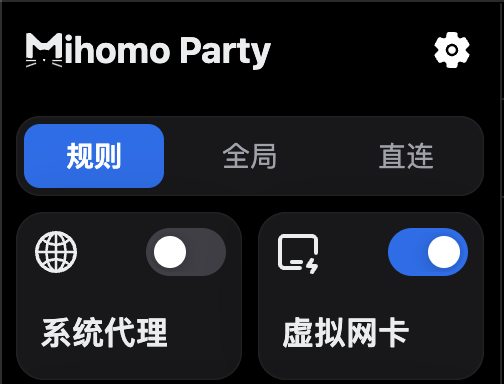
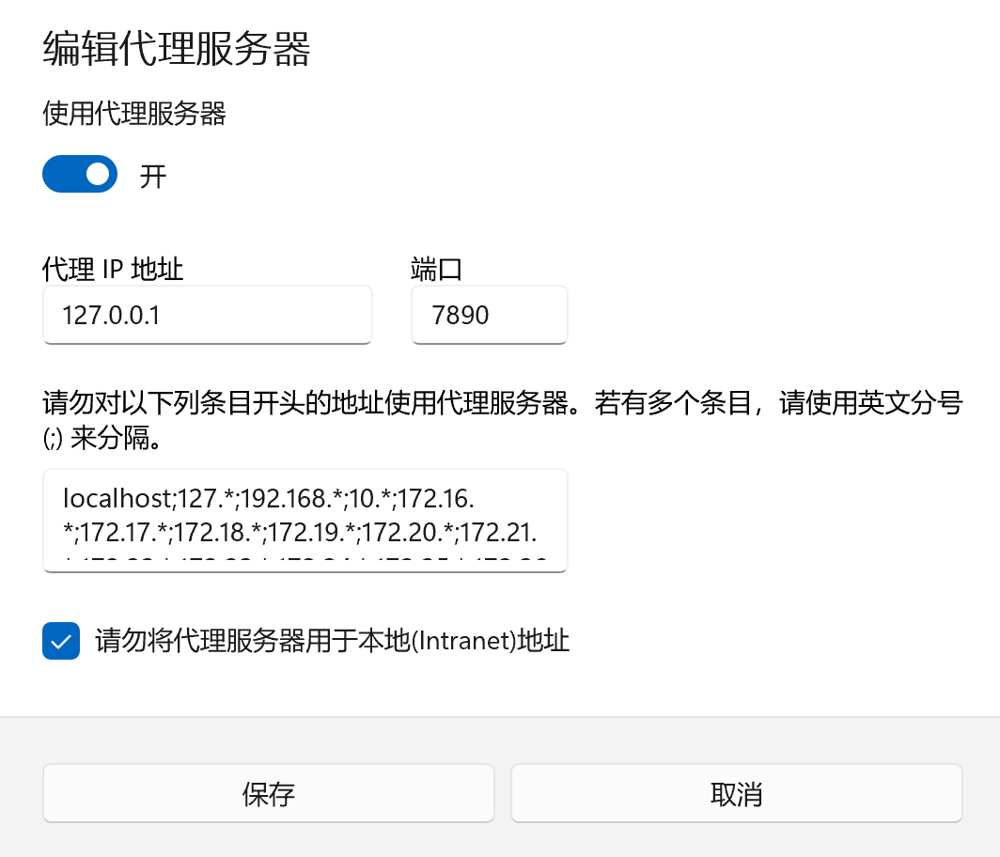
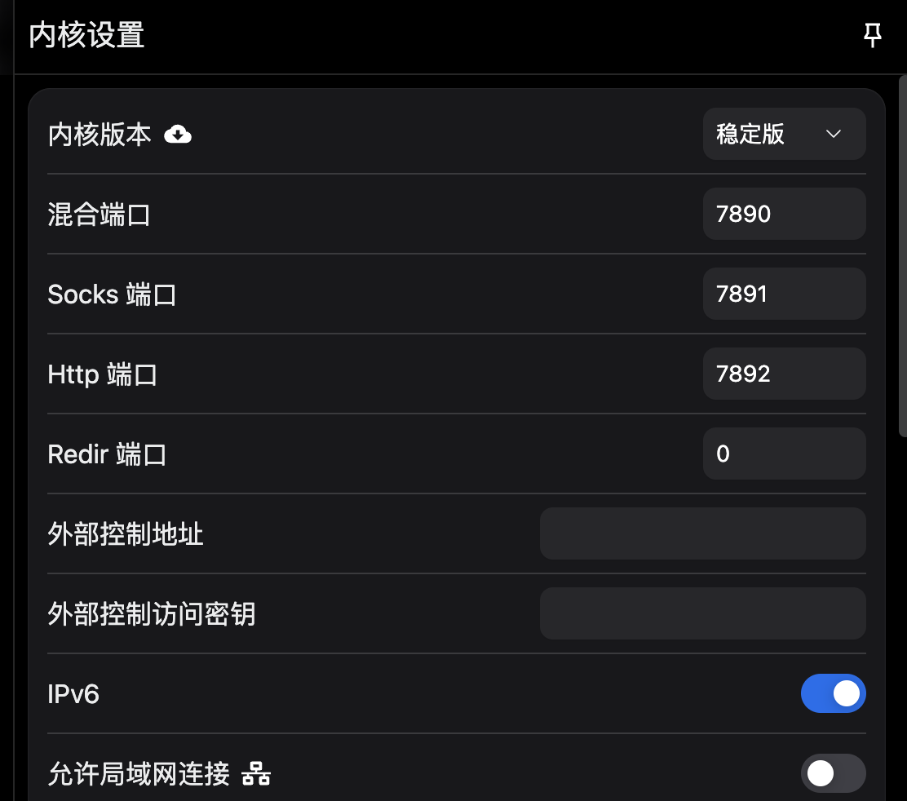

最近一段时间学习了计算机网络的基础知识，主要是为了解决科学上网的问题。
[友情链接](https://www.clashverge.dev/friendship.html)，目前主流的代理软件有以下几种：

## Clash 内核客户端

| 软件名           | 内核     | 平台    | 正式版     | 测试版       |
|----------------|--------|-------|----------|------------|
| mihomo-party   | Meta    | Windows Linux MacOS | v1.7.2   |
| clash-verge-rev | Meta    | Windows Linux MacOS | v2.1.2   | v2.1.2     |
| clash-nyanpasu  | Meta    | Windows Linux MacOS | v1.6.1   | pre-release |
| clash-verge     | Meta    | Windows Linux MacOS | v1.3.8   |            |
| clash_for_windows.pkg | Premium | Windows | v0.20.39 |            |
| FIClash        | Meta    | Windows Linux Macos Android | v0.8.76  |            |
| v2rayN         | Meta    | Windows | v7.9.3   |            |
| clashN         | Meta    | Windows | v2.22    |            |
| clashX         | Meta    | MacOS   | v1.18.0  |            |
| clashX-Pro     | Premium | MacOS   | v1.97.0.4|            |
| ClashX.Meta    | Meta    | MacOS   | v1.4.10  |            |
| ClashMetaForAndroid | Meta  | Android | v2.11.7  | v2.11.7   |
| ClashForAndroid | Premium | Android | v2.5.12  | v3.0.3    |

## 其他内核客户端

| 软件名             | 内核       | 平台       | 正式版      | 测试版      |
|------------------|----------|----------|-----------|------------|
| Karing          | sing-box | Windows Macos Android  | v1.1.0.578    |
| Hiddify          | sing-box | Windows Linux Macos Android  | v2.0.5    | v2.5.7     |
| NekoBoxForAndroid| sing-box | Android  | v1.3.8    | v1.3.8     |
| v2rayNG          | Xray, v2fly | Android | v1.9.33 | v1.9.38   |
| surfboard        | Xray     | Android   | mobile-2.24.9 |           |
| Shadowrocket     |          | iOS      | 使用中, 实时同步需要使用 Apple ID | |
| Stash            |          | iOS      | 使用中, 实时同步需要使用 Apple ID | |
| Surge 5          |          | iOS      | 应用内购, 订阅制需要使用 Apple ID | |
| Quantumult X     |          | iOS      | 使用中, 实时同步需要使用 Apple ID | |
| Loon             |          | iOS      | 使用中, 实时同步需要使用 Apple ID | |

目前推荐的代理客户端是 [mihomo-party](https://mihomoparty.org/#google_vignette)，`GitHub`项目：https://github.com/mihomo-party-org/mihomo-party。

为了更好地使用代理客户端，下面对一些基本的代理知识作解释，这样才能看懂各式的代理教程中的配置文件。

首先，代理客户端的 `UI` 前端界面不太重要，最重要的是`内核`，内核读取`配置文件（比如 .json 文件，.yaml 文件）`，然后执行相应的分流规则。所以，内核才是代理客户端的灵魂。

学习代理知识的前提是计算机网络基础，目前可以参考的代理知识网站有：
· https://karing.app/quickstart/
· https://wiki.metacubex.one/config/

推荐参考 https://karing.app/quickstart/ ，该教程短小精悍，通熟易懂，便于快速建立基本的代理知识框架。下面的内容将基于上述教程来讲解。

#### 整体概述
首先，流量的过程可以分为：入站->路由->出站。

#### 入站
流量进入代理软件。

#### 路由
它由`配置文件（比如 .json 文件，.yaml 文件）`设置，决定流量的走向，比如，使用什么策略组，是否走代理等等。

#### 出站
流量离开代理软件。

#### 自动选择
自动从候选列表中选择延迟最低的节点。

#### 直连
针对入站流量，不经过代理，直接连接。

#### 规则
针对入站流量，根据路由规则，代理流量。

#### 全局
针对入站流量，无视路由规则，全部代理流量。

#### TUN
虚拟网卡模式，透明代理代理的一种，使得所有的流量入站，同时会建立一个虚拟网卡，比如：

#### FakeIP
在`TUN`模式下用于改进/改善`DNS`查询性能/稳定性的一种技术。`Web` 浏览器发起的 `DNS` 查询被`代理客户端`拦截，并且用 `fakeip`响应，作为域名的`伪IP`，此时代理软件会建立`fakeip`和`域名`的映射关系。`Web`浏览器用`fakeip`发起 `TCP`连接，该请求报文再次被代理客户端拦截，根据报文中的 `fakeip`，找到对应的域名，进而被转发给代理服务器，此时域名解析在代理服务端，而不在本地，代理服务器获取响应数据后，再将该响应返回给请求方。如果是不需要经过代理的流量,则直接出站。从上述过程中，我们可以得知，使用`fakeip`作为响应，减少了一次`DNS`解析的过程，提高了响应速度。

在代理客户端中，我们可以经常看到`系统代理`和`TUN 模式(虚拟网卡模式)`，它们都是针对`入站`而言。

`系统代理`模式主要影响操作系统的流量监听：

这使得应用程序的流量重定向到本机的`7890`端口，而代理客户端又监听`7890`端口，进而转发给代理服务器。

但是，并不是所有的应用程序都遵循操作系统的流量重定向，比如终端模拟器，这常常导致终端`shell`中的`git clone`等命令没有走代理，为了解决这个问题，`TUN` 模式诞生，它通过修改路由表，强制将所有的流量重定向到虚拟网卡。

注意，无论是 `TUN` 模式还是系统代理模式，它们针对的是`入站`，而全局模式、规则模式、直连模式，影响的是`路由`。所以，开启了全局模式，并不代表所有的流量都走了代理。因为流量可能漏了。

